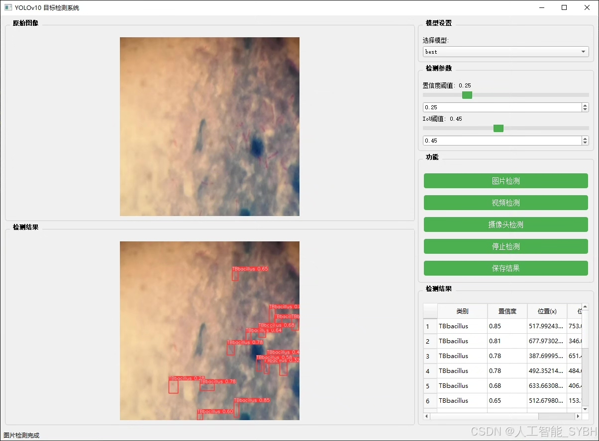
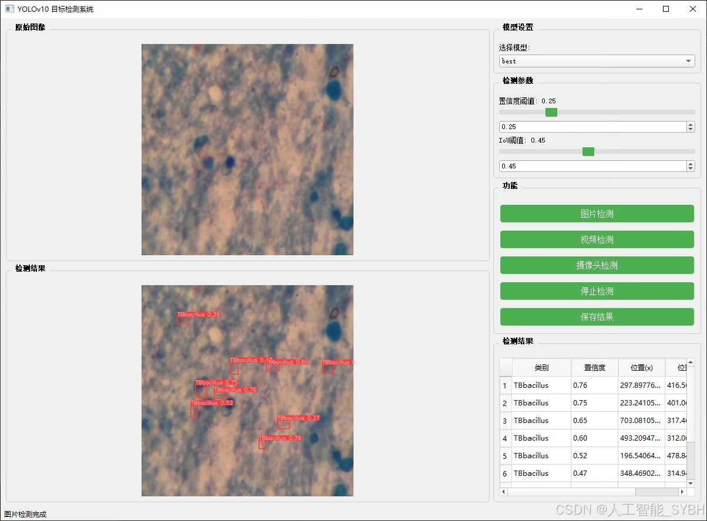
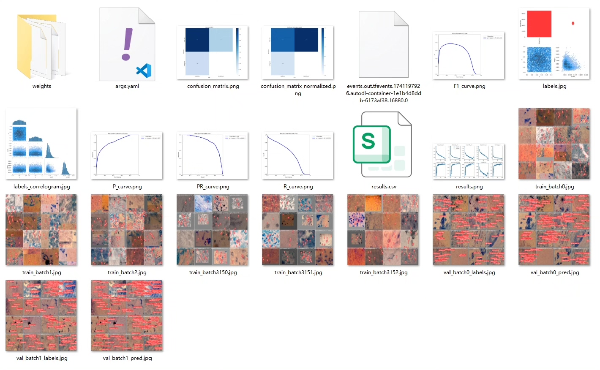
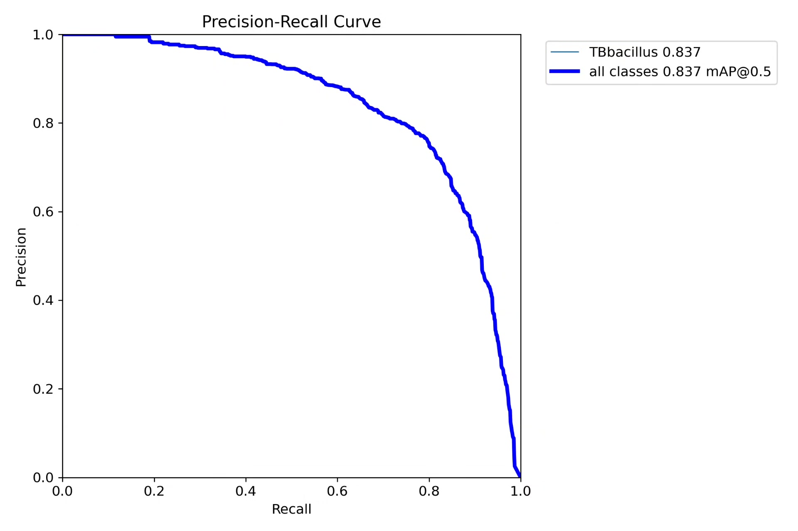
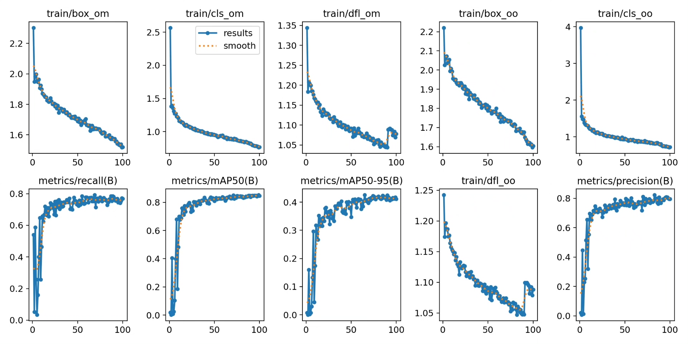
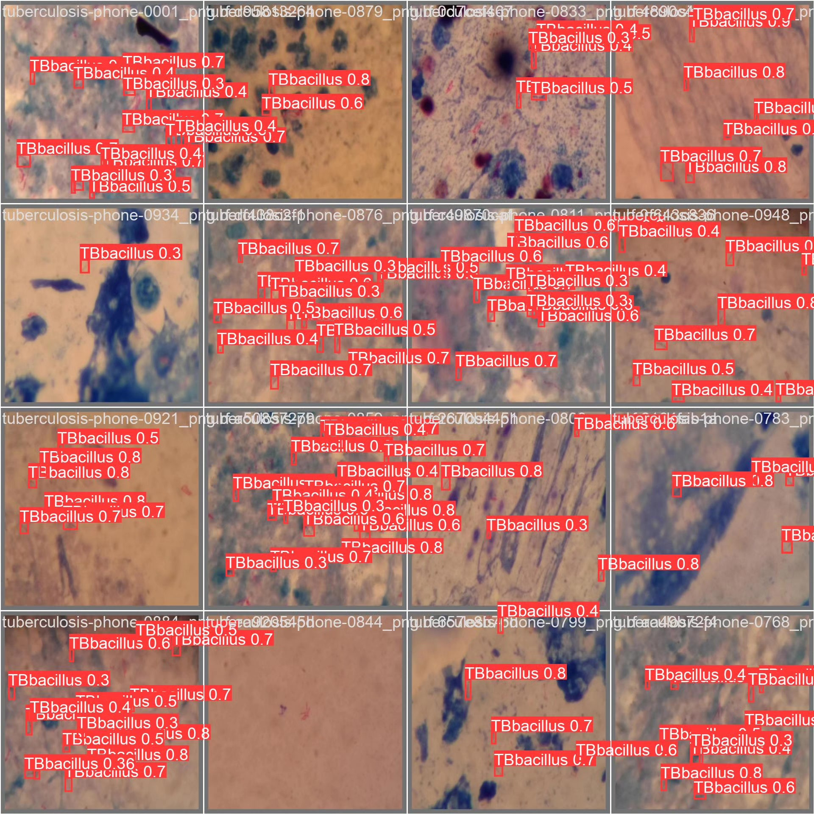
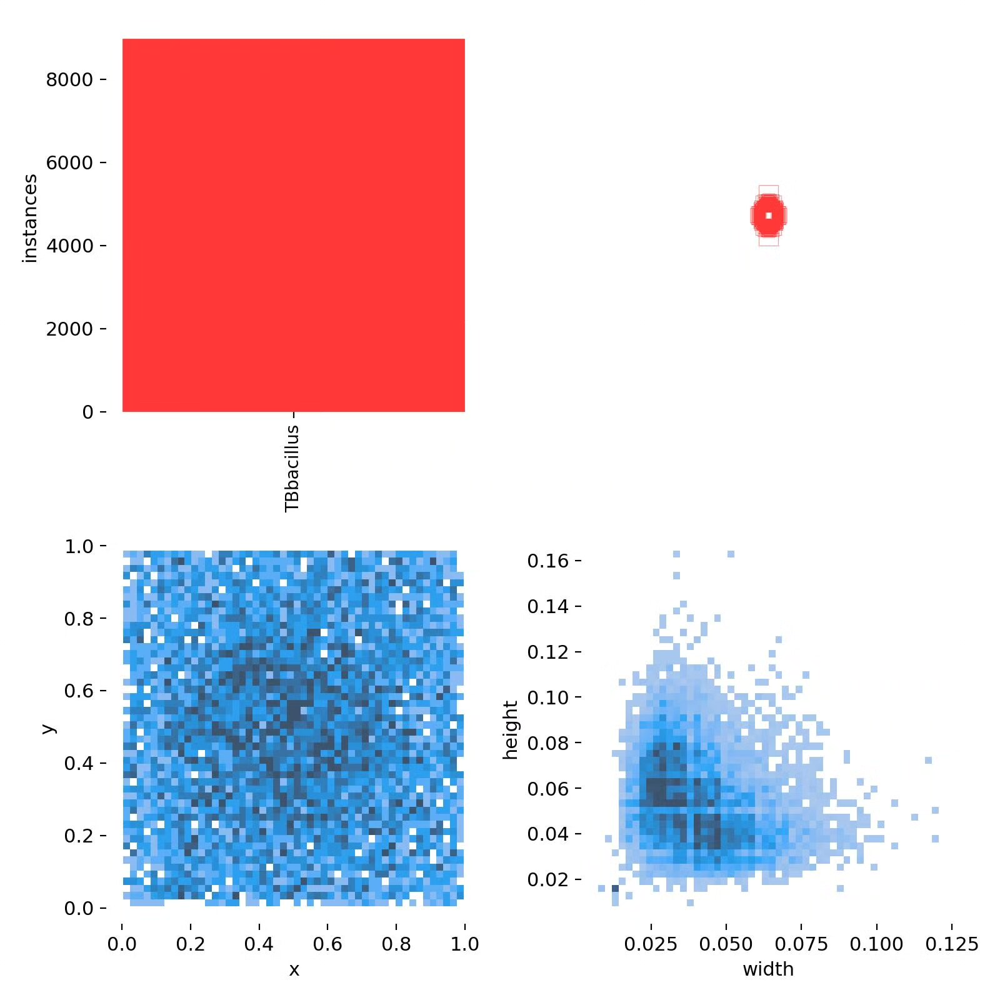
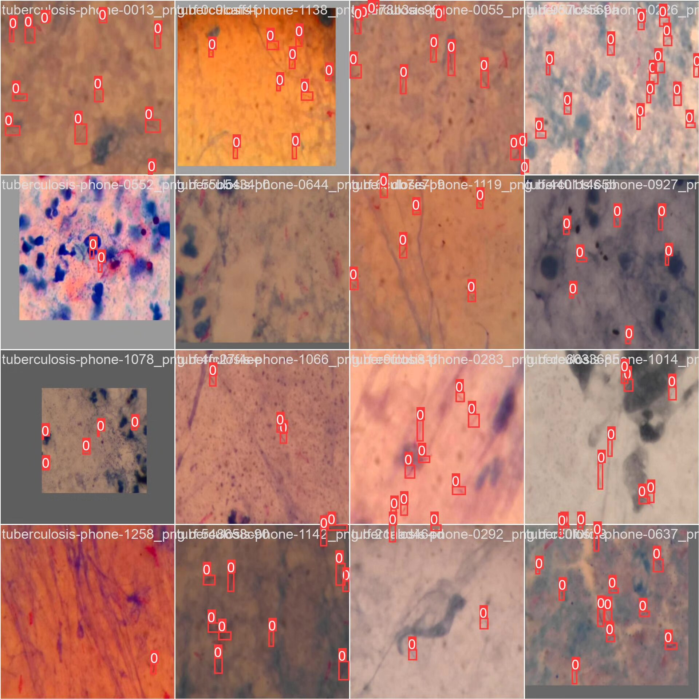

# Based on deep learning YOLOv10 for tuberculosis detection system (YOLOv10+)

## Body

Based on deep learning YOLOv10, a tuberculosis detection system (YOLOv10+YOLO dataset + UI interface + Python project source code + model)

Deep learning-based object detection technology has made significant progress in the field of medical image analysis. As the latest version of the YOLO series, YOLOv10 offers higher detection speed and accuracy, making it very suitable for detecting Mycobacterium tuberculosis in sputum smear images. The purpose of this project is to utilize the YOLOv10 algorithm, combined with sputum smear image data, to develop an efficient and accurate tuberculosis detection system, providing intelligent support for tuberculosis diagnosis.

The company's products have obtained the official commercial license certification from YOLO.

We provide after-sales service.

After payment, we will provide WeChat IDs for instant questions and answers.

Environmental configuration: We will provide a tutorial on environmental configuration, and WeChat will provide Q&A.

Remote installation service: If you need remote configuration, an additional fee of 69 is required,
If the configuration fails, all fees will be refunded (specially for old computers only refund installation fees).

Retraining dataset: After configuring the environment, you can train on your own computer.
If you need us to retrain, just pay 69 plus computing power fees (2.5 yuan/hour)

Full package after-sales service

## Images

## Payment

Here is a pay link on Stripe ( https://buy.stripe.com/3cs8yP7sY87d0vu9AB ). Please contact me lonlonago@foxmail.com after funding $89, and I will send you a complete data files , thank you!

